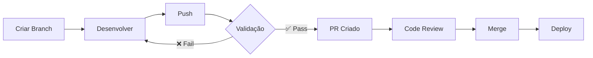

# 📚 Documentação do Projeto

Este diretório contém toda a documentação técnica do projeto **TorneSe.CapturaPagamento.Api**.

## 📋 Índice de Documentos

### 🎯 Features e Requisitos

| Documento | Descrição | Status |
|-----------|-----------|--------|
| [feature-implementar-logica-aplicacao.md](feature-implementar-logica-aplicacao.md) | Requisitos da feature de captura de pagamento | ✅ Implementado |

### 🔀 GitFlow e CI/CD

| Documento | Descrição | Quando Usar |
|-----------|-----------|-------------|
| [GITFLOW-GUIDE.md](GITFLOW-GUIDE.md) | **📖 Guia Completo** - Explicação detalhada do GitFlow, comandos e boas práticas | Leitura obrigatória para novos desenvolvedores |
| [GITFLOW-VISUAL.md](GITFLOW-VISUAL.md) | **📊 Resumo Visual** - Diagramas e fluxos do GitFlow | Referência rápida durante desenvolvimento |
| [WORKFLOW-GITHUB-ACTIONS.md](WORKFLOW-GITHUB-ACTIONS.md) | **🔧 Workflows** - Detalhes técnicos dos workflows de deploy | Configuração e troubleshooting de CI/CD |

### 🔄 Correções e Melhorias

| Documento | Descrição | Status |
|-----------|-----------|--------|
| [CORRECOES-PADRAO-REFERENCIA.md](CORRECOES-PADRAO-REFERENCIA.md) | Correções aplicadas seguindo projeto de referência | ✅ Concluído |

## 🚀 Início Rápido

### Para Desenvolvedores

1. **Leia primeiro:** [GITFLOW-GUIDE.md](GITFLOW-GUIDE.md) - Seção "Fluxo de Trabalho GitFlow"
2. **Referência rápida:** [GITFLOW-VISUAL.md](GITFLOW-VISUAL.md) - Seção "Comandos Rápidos"
3. **Criar feature:**
   ```bash
   git checkout -b feature/minha-feature
   git commit -m "feat: descrição"
   git push origin feature/minha-feature
   ```
4. **PR criado automaticamente** ✨

### Para Revisores

1. **Referência:** [GITFLOW-GUIDE.md](GITFLOW-GUIDE.md) - Seção "Boas Práticas"
2. Verificar validação automática no PR
3. Revisar código e checklist
4. Aprovar ou solicitar mudanças

### Para DevOps

1. **Configuração:** [WORKFLOW-GITHUB-ACTIONS.md](WORKFLOW-GITHUB-ACTIONS.md) - Seção "Secrets Necessários"
2. **Infraestrutura:** [WORKFLOW-GITHUB-ACTIONS.md](WORKFLOW-GITHUB-ACTIONS.md) - Seção "Pré-requisitos na AWS"
3. **Troubleshooting:** [GITFLOW-GUIDE.md](GITFLOW-GUIDE.md) - Seção "Troubleshooting"

## 📊 Estrutura do GitFlow

```
main (produção)
  ↑
  │ merge via PR
  │
feature/*, bug/*, fix/*
  ↑
  │ desenvolvimento
  │
developer
```

### Workflows Automáticos

| Workflow | Trigger | Ação |
|----------|---------|------|
| **pr-validation.yml** | Push em `feature/**`, `bug/**`, `fix/**` | Valida código e cria PR |
| **deploy.yml** | Push em `main` | Deploy na AWS Lambda |

## 🎯 Fluxo de Trabalho

### Desenvolvimento de Feature



### Processo Completo

1. **Desenvolver** (`feature/nova-funcionalidade`)
   - Workflow `pr-validation.yml` valida código
   - PR criado automaticamente

2. **Revisar** (GitHub PR)
   - Code review
   - Aprovação

3. **Merge** (para `main`)
   - Workflow `deploy.yml` executa
   - Deploy automático na AWS

## 📖 Guias por Tópico

### Git e Versionamento

- [GITFLOW-GUIDE.md](GITFLOW-GUIDE.md) - Seção "Nomenclatura de Branches"
- [GITFLOW-GUIDE.md](GITFLOW-GUIDE.md) - Seção "Comandos Úteis"

### CI/CD e Automação

- [WORKFLOW-GITHUB-ACTIONS.md](WORKFLOW-GITHUB-ACTIONS.md) - Workflow de deploy
- [GITFLOW-GUIDE.md](GITFLOW-GUIDE.md) - Seção "Comentários Automáticos"
- [GITFLOW-VISUAL.md](GITFLOW-VISUAL.md) - Seção "Gatilhos dos Workflows"

### Infraestrutura AWS

- [WORKFLOW-GITHUB-ACTIONS.md](WORKFLOW-GITHUB-ACTIONS.md) - Seção "Pré-requisitos na AWS"
- [../../deploy/README.md](../../deploy/README.md) - Guia completo de deploy

### Testes e Qualidade

- [GITFLOW-GUIDE.md](GITFLOW-GUIDE.md) - Seção "Cobertura de Código"
- [WORKFLOW-GITHUB-ACTIONS.md](WORKFLOW-GITHUB-ACTIONS.md) - Seção "Build and Test"

## 🔍 Troubleshooting

### Problemas Comuns

| Problema | Documento | Seção |
|----------|-----------|-------|
| Workflow não executou | [GITFLOW-GUIDE.md](GITFLOW-GUIDE.md) | Troubleshooting |
| PR não foi criado | [GITFLOW-GUIDE.md](GITFLOW-GUIDE.md) | Troubleshooting |
| Deploy falhou | [WORKFLOW-GITHUB-ACTIONS.md](WORKFLOW-GITHUB-ACTIONS.md) | Troubleshooting |
| Testes falhando | [GITFLOW-GUIDE.md](GITFLOW-GUIDE.md) | Troubleshooting |

## 📝 Convenções

### Commits Semânticos

```
feat: nova funcionalidade
fix: correção de bug
docs: documentação
refactor: refatoração
test: testes
chore: tarefas gerais
```

Referência completa: [GITFLOW-GUIDE.md](GITFLOW-GUIDE.md) - Seção "Boas Práticas"

### Labels de PR

| Label | Uso | Cor |
|-------|-----|-----|
| `enhancement`, `feature` | Novas funcionalidades | 🟢 Verde |
| `bug`, `bugfix` | Correções de bugs | 🔴 Vermelho |
| `fix`, `hotfix` | Correções urgentes | 🟠 Laranja |

## 🎓 Treinamento

### Novos Desenvolvedores

**Ordem de leitura recomendada:**

1. 📖 [GITFLOW-GUIDE.md](GITFLOW-GUIDE.md) - Ler completo (30 min)
2. 📊 [GITFLOW-VISUAL.md](GITFLOW-VISUAL.md) - Seção "Cenários" (10 min)
3. 🔧 [WORKFLOW-GITHUB-ACTIONS.md](WORKFLOW-GITHUB-ACTIONS.md) - Seção "Como Usar" (5 min)
4. 💻 Prática: Criar uma feature de teste

### Revisores de Código

**Foco em:**

- [GITFLOW-GUIDE.md](GITFLOW-GUIDE.md) - Seção "Template de Pull Request"
- [GITFLOW-GUIDE.md](GITFLOW-GUIDE.md) - Seção "Boas Práticas"
- [GITFLOW-VISUAL.md](GITFLOW-VISUAL.md) - Seção "Para Revisores"

### DevOps/SRE

**Foco em:**

- [WORKFLOW-GITHUB-ACTIONS.md](WORKFLOW-GITHUB-ACTIONS.md) - Completo
- [GITFLOW-GUIDE.md](GITFLOW-GUIDE.md) - Seção "Troubleshooting"
- [../../deploy/README.md](../../deploy/README.md) - Infraestrutura AWS

## 🔗 Links Externos

- [GitHub Actions Documentation](https://docs.github.com/en/actions)
- [GitFlow Workflow](https://www.atlassian.com/git/tutorials/comparing-workflows/gitflow-workflow)
- [Conventional Commits](https://www.conventionalcommits.org/)
- [AWS Lambda .NET](https://docs.aws.amazon.com/lambda/latest/dg/lambda-csharp.html)

## 📞 Suporte

### Precisa de Ajuda?

1. 🔍 Consulte a seção **Troubleshooting** nos documentos relevantes
2. 📖 Releia a documentação específica
3. 💬 Abra uma issue no repositório
4. 👥 Consulte a equipe

## 🔄 Manutenção da Documentação

Esta documentação deve ser atualizada sempre que:

- ✅ Novos workflows forem adicionados
- ✅ Processo de desenvolvimento mudar
- ✅ Infraestrutura AWS for modificada
- ✅ Novas boas práticas forem adotadas

**Última atualização:** Novembro 2025

---

**Nota:** Esta documentação foi criada seguindo os princípios SOLID, DRY, KISS e YAGNI conforme definido em [copilot-instructions.md](../copilot-instructions.md).
