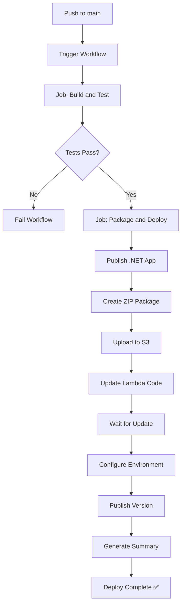

# Workflow GitHub Actions - CI/CD para AWS Lambda

## Implementação

Foi criado um workflow completo de CI/CD para deploy automatizado da aplicação na AWS Lambda, seguindo as melhores práticas para projetos .NET e o padrão do projeto de referência.

## Arquivo: `.github/workflows/deploy.yml`

### Características

- **Triggers**: Push para branch `main` ou execução manual via `workflow_dispatch`
- **Runtime**: .NET 8.0 com empacotamento para Linux (x64)
- **Estratégia**: Build → Test → Package → Deploy

### Jobs

#### 1. Build and Test

Responsável por validar o código antes do deploy:

```yaml
- Checkout do código
- Setup do .NET 8.0
- Restore de dependências
- Build em Release
- Execução de testes unitários
- Publicação dos resultados dos testes (trx)
```

**Benefícios:**
- Garante que apenas código compilável e testado seja deployado
- Feedback rápido sobre falhas de build ou testes
- Relatório visual dos testes no GitHub Actions

#### 2. Package and Deploy to Lambda

Executa o empacotamento e deploy:

```yaml
- Checkout do código
- Setup do .NET 8.0
- Configuração das credenciais AWS
- Instalação do AWS Lambda Tools
- Publish da aplicação (linux-x64)
- Criação do pacote .zip
- Upload para S3 com timestamp
- Update do código da Lambda
- Aguardar conclusão do update
- Configuração das variáveis de ambiente
- Publicação de nova versão
- Geração de deployment summary
```

**Benefícios:**
- Deploy totalmente automatizado
- Versionamento automático com descrição do commit
- Backup dos deployments no S3
- Configuração centralizada de variáveis de ambiente
- Summary detalhado do deployment

## Secrets Necessários no GitHub

### Credenciais AWS (Obrigatórios)

| Secret | Descrição | Onde Obter |
|--------|-----------|------------|
| `AWS_ACCESS_KEY_ID` | Access Key da AWS | IAM Console → Users → Security credentials |
| `AWS_SECRET_ACCESS_KEY` | Secret Access Key | IAM Console → Users → Security credentials |

### Variáveis de Ambiente (Obrigatórios)

| Secret | Descrição | Exemplo |
|--------|-----------|---------|
| `SQS_QUEUE_URL` | URL da fila SQS | `https://sqs.us-east-1.amazonaws.com/123456789/payment-events` |
| `APP_ENV` | Ambiente de execução | `Production` ou `Development` |
| `LOG_LEVEL` | Nível de log | `Information`, `Debug`, `Warning` |
| `STRIPE_SIGNING_SECRET` | Secret do webhook Stripe | `whsec_...` |

## Variáveis de Ambiente do Workflow

Configuradas no arquivo `deploy.yml`:

| Variável | Valor Padrão | Ajustável? |
|----------|--------------|------------|
| `AWS_REGION` | `us-east-1` | ✅ Sim |
| `DOTNET_VERSION` | `8.0.x` | ⚠️ Não recomendado |
| `PROJECT_PATH` | `src/TorneSe.CapturaPagamento.Api` | ⚠️ Não recomendado |
| `S3_BUCKET` | `torne-se-captura-pagamento-api-deployments` | ✅ Sim |
| `LAMBDA_FUNCTION_NAME` | `TorneSe-CapturaPagamento-Api` | ✅ Sim |

## Pré-requisitos na AWS

### 1. Função Lambda

Deve existir antes de executar o workflow:

```
Nome: TorneSe-CapturaPagamento-Api
Runtime: .NET 8 (Amazon Linux 2)
Handler: TorneSe.CapturaPagamento.Api
Timeout: 30 segundos (recomendado)
Memória: 512 MB (recomendado)
```

**IAM Role da Lambda deve ter permissões para:**
- `logs:CreateLogGroup`
- `logs:CreateLogStream`
- `logs:PutLogEvents`
- `sqs:SendMessage`

### 2. Fila SQS

```
Tipo: Standard Queue
Nome: Sugestão: payment-events-queue
URL: Configurada no secret SQS_QUEUE_URL
```

### 3. Bucket S3 (Criado Automaticamente)

```
Nome: torne-se-captura-pagamento-api-deployments
Região: us-east-1 (ou conforme AWS_REGION)
Propósito: Armazenar pacotes de deployment
```

O workflow cria o bucket automaticamente se não existir.

### 4. API Gateway (Opcional)

```
Tipo: HTTP API (recomendado)
Integração: Lambda Proxy
Rota: POST /webhooks/stripe
Payload Format Version: 2.0
```

## Como Usar

### Deploy Automático

1. Faça suas alterações no código
2. Commit e push para a branch `main`:
   ```bash
   git add .
   git commit -m "feat: sua descrição"
   git push origin main
   ```
3. O workflow será executado automaticamente
4. Acompanhe em: `Actions → Deploy to AWS Lambda`

### Deploy Manual

1. Acesse o repositório no GitHub
2. Vá para `Actions → Deploy to AWS Lambda`
3. Clique em `Run workflow`
4. Selecione a branch (geralmente `main`)
5. Clique em `Run workflow`

## Saída do Workflow

### Deployment Summary

O workflow gera um summary detalhado após o deploy:

```
## Deployment Summary 🚀

**Status:** ✅ Success
**Function:** TorneSe-CapturaPagamento-Api
**Version:** 42
**Region:** us-east-1
**Package:** s3://bucket/deployments/TorneSe.CapturaPagamento.Api-20240101-120000.zip
**Commit:** abc123def456...
**Branch:** main

### Environment Variables
- AWS_REGION: us-east-1
- APP_ENV: Production
- LOG_LEVEL: Information
```

## Fluxo de Trabalho



## Versionamento

### Lambda Versions

Cada deploy cria uma nova versão da Lambda com:

- **Número da versão**: Auto-incrementado pela AWS
- **Descrição**: `"Deployed on YYYY-MM-DD from commit {SHA}"`
- **Código**: Referência ao pacote S3

### Pacotes S3

Cada deploy gera um pacote único:

```
s3://torne-se-captura-pagamento-api-deployments/
  deployments/
    TorneSe.CapturaPagamento.Api-20240101-120000.zip
    TorneSe.CapturaPagamento.Api-20240101-150000.zip
    TorneSe.CapturaPagamento.Api-20240102-093000.zip
```

**Formato do timestamp**: `YYYYMMDD-HHMMSS`

## Troubleshooting

### Erro: "Function not found"

**Causa**: Lambda não existe na AWS  
**Solução**: Criar função Lambda com o nome `TorneSe-CapturaPagamento-Api`

### Erro: "Access Denied" ao criar bucket

**Causa**: Credenciais AWS sem permissão para criar bucket  
**Solução**: 
1. Criar bucket manualmente
2. Ou adicionar permissão `s3:CreateBucket` ao usuário IAM

### Erro: "Invalid handler"

**Causa**: Handler da Lambda não configurado corretamente  
**Solução**: Configure o handler para `TorneSe.CapturaPagamento.Api`

### Testes falhando no workflow mas passando localmente

**Causa**: Diferenças de ambiente ou dependências  
**Solução**: 
1. Verificar versão do .NET (deve ser 8.0)
2. Verificar dependências de testes
3. Adicionar logs para diagnóstico

### Deploy lento

**Causa**: Pacote muito grande ou região distante  
**Solução**:
1. Revisar dependências desnecessárias
2. Usar região AWS mais próxima
3. Aumentar timeout do workflow

## Melhorias Futuras

### Possíveis Extensões

1. **Ambientes Múltiplos**
   - Deploy para DEV, HML e PROD
   - Branches diferentes para cada ambiente
   - Aprovação manual para produção

2. **Rollback Automático**
   - Detectar falhas após deploy
   - Reverter para versão anterior
   - Notificação de rollback

3. **Testes de Integração**
   - Executar testes contra a Lambda deployada
   - Validar integração com SQS
   - Testes end-to-end com webhooks

4. **Notificações**
   - Slack notifications
   - Email notifications
   - Discord/Teams integration

5. **Análise de Código**
   - SonarQube analysis
   - Security scanning
   - Dependency vulnerability check

6. **Performance Monitoring**
   - CloudWatch metrics
   - X-Ray tracing
   - Custom metrics

## Documentação Relacionada

- [GitHub Actions Documentation](https://docs.github.com/en/actions)
- [AWS Lambda .NET](https://docs.aws.amazon.com/lambda/latest/dg/lambda-csharp.html)
- [AWS CLI Reference](https://awscli.amazonaws.com/v2/documentation/api/latest/index.html)
- [.NET Lambda Deployment](https://github.com/aws/aws-lambda-dotnet)

## Suporte

Para problemas ou dúvidas:

1. Verifique os logs do workflow no GitHub Actions
2. Consulte os logs do CloudWatch para a Lambda
3. Revise a documentação deste arquivo
4. Abra uma issue no repositório
